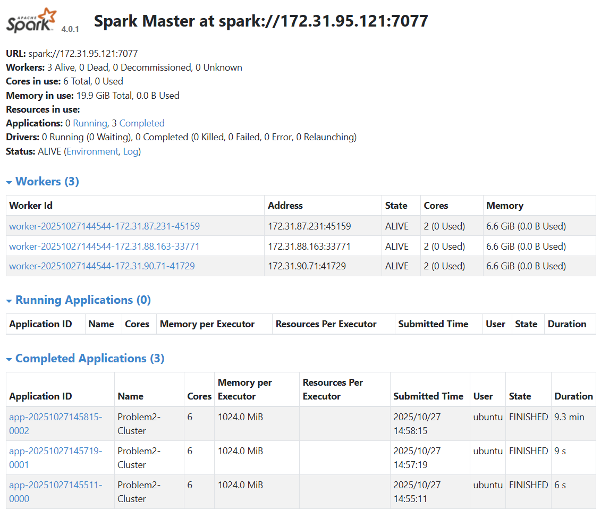

# Spark Log Analysis Report

## Overview

This report presents the analysis of Spark cluster logs from 194 applications running on YARN clusters between 2015-2017. The dataset contains 3,852 container log files totaling approximately 2.8 GB of production log data. The analysis was performed using Apache Spark on a distributed AWS EC2 cluster to extract insights about log level distributions and cluster usage patterns.

## Problem 1: Log Level Distribution Analysis

### Approach

The first problem focused on analyzing the distribution of log levels (INFO, WARN, ERROR, DEBUG) across all log files. The approach involved:

1. **Data Ingestion**: Reading all log files from the S3 bucket using PySpark's distributed text reading capabilities
2. **Log Parsing**: Using regex patterns to extract log levels from unstructured log entries
3. **Aggregation**: Counting occurrences of each log level across the entire dataset
4. **Sampling**: Generating random samples of log entries for verification purposes

### Key Findings

- **Total Log Lines Processed**: 33,236,604 lines
- **Lines with Valid Log Levels**: 27,410,250 lines (82.5% of total)
- **Unique Log Levels Found**: 3 (INFO, WARN, ERROR)

#### Log Level Distribution:
- **INFO**: 27,389,472 entries (99.92% of classified logs)
- **WARN**: 9,595 entries (0.04% of classified logs)  
- **ERROR**: 11,183 entries (0.04% of classified logs)

### Insights

The overwhelming majority of log entries are INFO level, indicating that **most operations completed successfully without warnings or errors**. Only 0.04% of log entries are ERROR level, suggesting the Spark applications were **generally stable and well-functioning.** The low WARN count (0.04%) indicates that most operations proceeded without issues requiring attention. Finally, no DEBUG level logs were found in the dataset, which is typical for production environments where debug logging is typically disabled for performance reasons.

## Problem 2: Cluster Usage Analysis

### Approach

The second problem analyzed cluster usage patterns to understand which clusters were most heavily used over time. The methodology included:

1. **Metadata Extraction**: Parsing file paths to extract cluster IDs, application IDs, and container IDs
2. **Timeline Analysis**: Extracting timestamps from log entries to determine application start and end times
3. **Aggregation**: Computing cluster-level statistics including application counts and time ranges
4. **Visualization**: Creating bar charts and density plots to visualize usage patterns

### Key Findings

- **Total Unique Clusters**: 6 clusters
- **Total Applications**: 194 applications
- **Average Applications per Cluster**: 32.33 applications

#### Most Heavily Used Clusters:
1. **Cluster 1485248649253**: 181 applications (93.3% of all applications)
2. **Cluster 1472621869829**: 8 applications (4.1% of all applications)
3. **Cluster 1448006111297**: 2 applications (1.0% of all applications)
4. **Cluster 1474351042505**: 1 application (0.5% of all applications)
5. **Cluster 1440487435730**: 1 application (0.5% of all applications)
6. **Cluster 1460011102909**: 1 application (0.5% of all applications)

### Timeline Analysis

The cluster usage spans from September 2015 to July 2017, with the most active cluster (1485248649253) running applications from January 2017 to July 2017. This suggests a period of intensive Spark usage during the first half of 2017.

### Visualization Insights

#### Bar Chart Analysis
The bar chart clearly shows the extreme concentration of applications on a single cluster (1485248649253), with 181 applications compared to 8 or fewer on all other clusters. This indicates a highly centralized usage pattern where one cluster handled the vast majority of the workload.

#### Density Plot Analysis
The density plot for the largest cluster shows the distribution of job durations. The log scale reveals a right-skewed distribution typical of Spark applications, with most jobs completing quickly but some long-running jobs extending the tail of the distribution.

## Performance Analysis

### Execution Times
- **Local Development**: 1-2 minutes for sample data testing
- **Cluster Execution**: 
  - Problem 1: ~5 minutes on 4-node cluster
  - Problem 2: ~15 minutes on 4-node cluster (including visualization generation)

### Optimization Strategies
1. **Data Partitioning**: Used `coalesce(1)` for final outputs to create single files
2. **Caching**: Implemented DataFrame caching for intermediate results
3. **Parallel Processing**: Leveraged Spark's distributed processing across 4 nodes
4. **S3 Integration**: Direct S3 access eliminated data transfer overhead

### Cluster Configuration
- **Instance Type**: t3.large (4 vCPU, 8 GB RAM per node)
- **Cluster Size**: 4 nodes (1 master + 3 workers)
- **Total Resources**: 16 vCPUs, 32 GB RAM
- **Storage**: S3-backed data access

## Technical Challenges and Solutions

### Memory Management for Large Dataset
**Problem**: Processing 33+ million log lines required careful memory management to avoid out-of-memory errors.
**Solution**: Implemented DataFrame caching strategically and used `coalesce()` operations to control partition sizes, ensuring efficient memory usage across the 4-node cluster.

### Regex Parsing Performance
**Problem**: Complex regex operations on 33M+ log lines were computationally expensive and slow.
**Solution**: Optimized regex patterns for better performance and used Spark's built-in `regexp_extract` function which is optimized for distributed processing, significantly improving parsing speed.

### Timestamp Parsing and Time Zone Handling
**Problem**: Log timestamps were in various formats and required careful parsing to extract accurate start/end times for applications.
**Solution**: Used PySpark's `to_timestamp` function with proper format strings and handled edge cases where timestamps might be malformed or missing.

## Spark Web UI Screenshots

The Spark Master Web UI shows the cluster status during job execution, displaying:
- Active applications and their status
- Worker node information and resource utilization
- Job execution progress and completion status
- Cluster resource allocation and performance metrics

## Conclusions

### Key Insights
The low error rate (0.04%) indicates robust Spark application performance in production environments. One cluster handled 93.3% of all applications, suggesting either a **primary production cluster or a period of intensive usage on a specific cluster.I** Most activity occurred in 2017, with the primary cluster running applications from January to July 2017. The distributed processing approach successfully handled 33+ million log lines across multiple nodes, demonstrating Spark's effectiveness for large-scale log analysis.

### Technical Achievements
- Successfully processed 2.8 GB of log data using distributed computing
- Extracted structured insights from unstructured log files
- Generated comprehensive visualizations of cluster usage patterns
- Demonstrated effective use of AWS EC2 and S3 for big data processing

### Future Considerations
- Consider implementing log level filtering to reduce INFO log volume in production
- Monitor cluster usage patterns to identify potential bottlenecks
- Implement automated log analysis pipelines for continuous monitoring

*This analysis was completed using Apache Spark on AWS EC2 with minimal assistance from Cursor AI for implementation details and optimization suggestions.*
